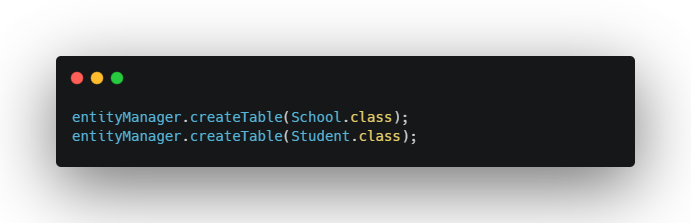

Overview
---
A very simple ORM for Java. Used for performing **CRUD operations** and making **relationships** between tables
in a **MySQL Database** by properly mapping their corresponding Java Classes with the right annotations.

Features
---
- Creating SQL Queries by hand with the *createQuery()* method
- Creating and Dropping tables with the *createTable()* and *dropTable()* methods
- Inserting or Updating an entity in a table with the *persist()* method (more information on how the method works in the **EntityManager** Interface)
- Deleting an entity from a table with the *remove()* method
- Retrieving an entity from a table by its id with the *find()* method
- Retrieving all entities from a table with the *findAll()* method
- The *showSql()* method determines if the SQL generated from calling these methods should be shown in the console or not

How to annotate a Java Class properly
---
Here we have an exaple class **Student**, which has some basic fields like id, name, age and it has a field with a class type **School**, which refers to the school the current student attends.

If we want the class to be properly mapped to a database table (for example if we want the id to be "AUTO_INCREMENT", the school field to be a foreign key column which stores an id from the school table, etc.) it should be annotated something like this:

How to use the ORM
---
Now to create a table using the **Student** class and to do other database operations with this ORM, you need to learn how to use it. Open your class, which has the **main** method in it and let's get started.

1. First we need to create a connection with the databsae, using the **Connector** class:

   

2. Using that connection, we are going to create an instance of the **EntityManager** Interface:

   

3. Now because we have a foreign key field in the **Student** class, that refers to the **School** class, we need to create a table for the **School** class first, because otherwise we will break the program :)

   

   This is how the **students** table will look like inisde MySQL after running the *createTable()* method:

   

4. And from now on we can do all kinds of operations with these tables: we can create instances of the Java Classes and insert them into their tables, we can later delete them from the tables if we want to, we can drop the tables, etc. For more examples, open the **Main** class inside of the **Example** folder.